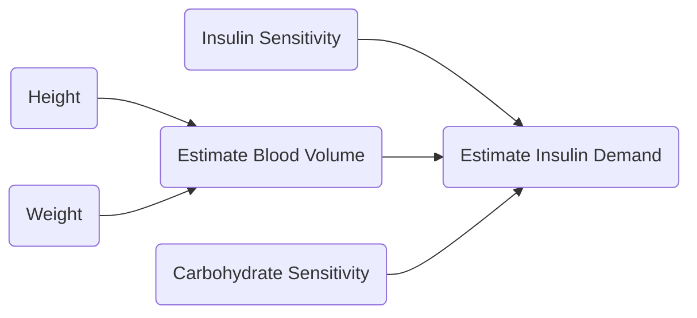

# Closed Loop System for Raspberry Pi Zero W
## by Richard McHorgh
  
### Todo:
- [ ] Research
- [ ] Get Bolus Parameters
- [ ] Get Basal Parameters
- [ ] Get Closed Loop Parameter
- [ ] Record Keeping
- [ ] Write, or borrow closed loop functions
- [ ] Bluetooth Interface with Android
- [ ] GUI

### Bolus Parameters:
- Carb Units
- Carb Ratios
- Blood Glucose Units
- Sensitivity
- Blood Glucose Target Range
- Active Insulin Time  
- Scroll Rate

### Basal Parameters:
- Rates

### Closed Loop Parameters
- Height
- Weight
- Sensitivity

### Features
- Trend Based Missed Bolus Reminders 
- Temp basal

### Research
Sorry if I butcher your life's work 

### Disclaimer
Literally all of this is based on my rudimentary idea of how this stuff works, 8 years of having Type 1, and like maybe 10 hours of research.

I think I know my body, but I may be wrong. If you use this, it is at your own risk ... so don't sue me chief. Its not my fault if you are as stupid as me. 
			
-Richard :-)